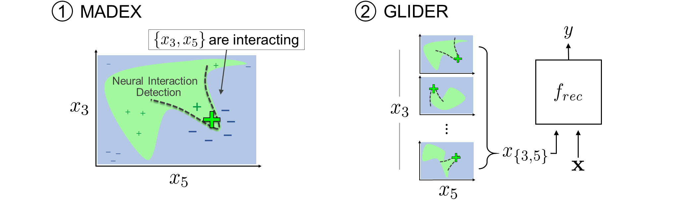
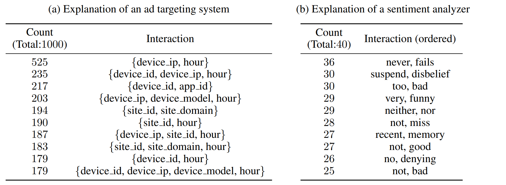
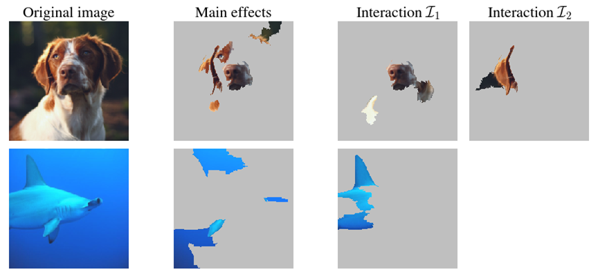

# Feature Interaction Interpretability via Interaction Detection

This is the official code repository for the paper, "Feature Interaction Interpretability: A Case for Explaining Ad-Recommendation Systems via Neural Interaction Detection".



Example Explanations

* Global Interpretations
<p align="center">

</p>

* Local Interpretations (of ResNet classifications)
<p align="center">

</p>

<br />

Michael Tsang, Dehua Cheng, Hanpeng Liu, Xue Feng, Eric Zhou, Yan Liu, [Feature Interaction Interpretability: A Case for Explaining Ad-Recommendation Systems via Neural Interaction Detection](https://openreview.net/forum?id=BkgnhTEtDS), ICLR 2020.

Neural Interaction Detection:\
Michael Tsang, Dehua Cheng, Yan Liu, [Detecting Statistical Interactions from Neural Network Weights](https://openreview.net/forum?id=ByOfBggRZ), ICLR 2018.


## Setup


In a linux environment with Python 3.6:

```bash
pip install -r requirements.txt
```

We require CUDA 10 support to use GLIDER.

## Usage
### 1. MADEX

**MADEX (Model-Agnostic Dependency EXplainer)** is a method for interpreting feature interactions from a black-box prediction model per data instance. It contains two versions of Neural Interaction Detection (NID): the original NID and GradientNID. NID is a fast and accurate method to detect arbitrary-order interactions in polynomial time. GradientNID exactly detects interactions from an explainer MLP. The following domains are showcased: DNA, graph, image, and text modeling.

<details><summary><b>Show instructions</b></summary>

    
```bash
cd 1.\ madex/
```

The following notebooks are available to demo MADEX:
* `madex_example_dna.ipynb`
* `madex_example_graph.ipynb`
* `madex_example_image.ipynb`
* `madex_example_text.ipynb`
    
</details>

### 2. GLIDER

**GLIDER (GLobal Interaction Detection and Encoding for Recommendation)** takes MADEX beyond model interpretation on recommendation tasks (or tablular data modeling). GLIDER detects feature interactions that reoccur across data instances from a source recommender model, then explicitly encodes the interactions in a target recommender model. This process is a form of automatic feature engineering.

<details><summary><b>Show instructions</b></summary>


```bash
cd 2.\ glider/
```

#### A. Data Preparation

Please follow instructions in the [AutoInt repo](https://github.com/shichence/AutoInt) for how to prepare data splits.

The same code is also provided in this repo and follows the same series of commands. The Criteo dataset is found [here](https://labs.criteo.com/2014/02/kaggle-display-advertising-challenge-dataset/). Place it in the path `data/autoint/criteo`.

```bash
mkdir data/autoint/criteo
python data/initial_data_prep/criteo/preprocess.py
python data/initial_data_prep/Kfold_split/stratifiedKfold.py
python data/initial_data_prep/criteo/scale.py
```

#### B. Global Interaction Detection

First, train a baseline AutoInt model.

```bash
python models/autoint/train.py --exp baseline --data data/autoint/criteo --save_path experiments/autoint/criteo/baseline/ --run_times 1 --gpu 0 
```

Then, run global interaction detection on this model.

```bash
python detect_global_interactions.py --save_path experiments/autoint/criteo/baseline/1/ --data criteo --save_id SAVEID --par_batch_size par_batch_size
```

* ```par_batch_size``` is the number of data instances to process in parallel. Set this based on the number of CPU processes and GPU memory available.
* ``SAVEID`` shows up again later. Use a descriptive identifier.


#### C. Cross Feature Generation

To generate cross features:

```bash
python make_cross_feature_data.py --data_file experiments/detected_interactions_criteo_SAVEID.pickle --exp cross_K40 --K 40 --data criteo --autoint_save_path data/autoint/criteo --deepctr_save_path data/deepctr/criteo --save_base_data true
```

#### D. Train DeepCTR models:

* Wide&Deep: `WDL`
* DeepFM: `DeepFM` 
* Deep&Cross: `DCN`
* xDeepFM: `xDeepFM`

Baseline:
```bash
python train_deepctr.py --model WDL --ds criteo --exp baseline --patience 5 --test_id baseline_experiment --gpu 0
```

Baseline + GLIDER (distillation):
```bash
python train_deepctr.py --model WDL --ds criteo --exp cross --patience 5 --test_id cross_experiment --gpu 0 --d_cross_exp cross_K40 --n_cross 40
```


#### E. Train AutoInt models:

** note about mkdir expriments for training autoint models


Baseline + GLIDER (enhancement):
```bash
python models/autoint/train.py --exp cross --data data/autoint/criteo --save_path experiments/autoint/criteo/cross/ --gpu 0 --cross_exp cross_K40
```

</details>
    

## References

```
@inproceedings{tsang2020feature,
  title={Feature Interaction Interpretability: A Case for Explaining Ad-Recommendation Systems via Neural Interaction Detection},
  author={Michael Tsang and Dehua Cheng and Hanpeng Liu and Xue Feng and Eric Zhou and Yan Liu},
  booktitle={International Conference on Learning Representations},
  year={2020},
  url={https://openreview.net/forum?id=BkgnhTEtDS}
}
```

Neural Interaction Detection:
```
@article{tsang2017detecting,
  title={Detecting Statistical Interactions from Neural Network Weights},
  author={Michael Tsang and Dehua Cheng and Yan Liu},
  journal={arXiv preprint arXiv:1705.04977},
  year={2017}
}
```


